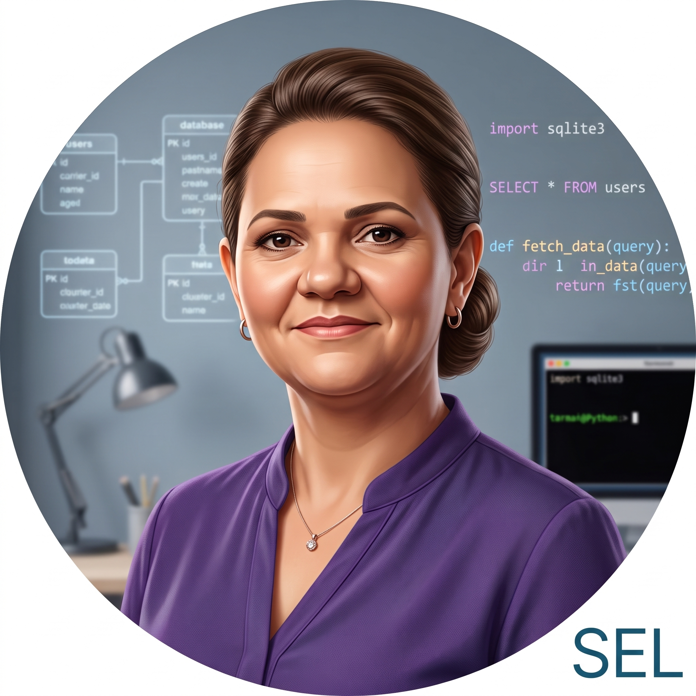

SEL — Tecnologia para Elas

  

  <strong>Saber, Evoluir e Liderar.</strong> 
  Uma mentora virtual para meninas e mulheres que estão aprendendo Python e Banco de Dados.

Sobre o projeto

A SEL é uma assistente de Inteligência Artificial criada para apoiar meninas e mulheres que estão começando seus estudos em tecnologia, com foco exclusivo em Python e Banco de Dados.

Seu objetivo não é apenas entregar respostas prontas. A SEL procura explicar conceitos, oferecer exemplos, analisar erros e conduzir o raciocínio da estudante até que ela desenvolva mais autonomia.

O nome SEL representa os três pilares do projeto:

Saber: aprender conceitos de forma clara e acessível;

Evoluir: avançar gradualmente nos estudos;

Liderar: conquistar autonomia e confiança na tecnologia.

O nome também é uma homenagem a Selma, mãe da idealizadora do projeto, cuja história inspirou a criação de uma ferramenta voltada à educação e à abertura de oportunidades para outras mulheres.

Objetivos

Tornar o aprendizado de Python e Banco de Dados mais acolhedor;

Explicar termos técnicos utilizando uma linguagem simples;

Relacionar conteúdos acadêmicos com situações do mercado de trabalho;

Auxiliar na interpretação de códigos, consultas SQL e mensagens de erro;

Incentivar o raciocínio e a autonomia da estudante;

Criar um ambiente seguro e sem julgamentos para tirar dúvidas.

Funcionalidades

Conversa com uma assistente de IA personalizada;

Respostas direcionadas a Python e Banco de Dados;

Continuidade do contexto durante a conversa;

Botão para iniciar uma nova conversa;

Envio da mensagem pela tecla Enter;

Quebra de linha com Shift + Enter;

Indicador visual enquanto a SEL está pensando;

Tratamento de erros de comunicação com o servidor;

Rolagem automática para a mensagem mais recente;

Diferenciação visual entre mensagens da usuária e da SEL;

Avatar personalizado da mentora;

Interface responsiva para computador, tablet e celular.

Tecnologias utilizadas

Front-end

HTML5;

CSS3;

JavaScript;

Fetch API.

Back-end

Node.js;

Express;

OpenAI SDK;

dotenv;

CORS.

Estrutura do projeto

Projeto-IASEL/
├── public/
│   ├── images/
│   │   └── sel-avatar.jpg
│   ├── index.html
│   ├── script.js
│   └── style.css
├── .env
├── .gitignore
├── package.json
├── package-lock.json
├── README.md
├── selPrompt.js
└── server.js

Responsabilidade dos arquivos

Arquivo

Responsabilidade

public/index.html

Estrutura e conteúdo da interface do chat

public/style.css

Aparência, cores, responsividade e animações

public/script.js

Interação do chat e comunicação com o servidor

public/images/sel-avatar.jpg

Imagem utilizada no perfil da SEL

server.js

Servidor Express e integração com o serviço de IA

selPrompt.js

System Prompt que define a identidade e as regras da SEL

.env

Armazena a chave da API localmente

.gitignore

Impede o envio de arquivos privados e dependências ao GitHub

package.json

Dependências e comandos do projeto

Como o sistema funciona

flowchart LR
    A[Usuária] --> B[Interface do chat]
    B -->|POST /chat| C[Servidor Express]
    C --> D[Serviço de IA]
    D --> C
    C --> B

A usuária escreve uma pergunta na interface;

O JavaScript envia a mensagem para a rota /chat usando fetch;

O servidor recebe a mensagem e adiciona as instruções da persona SEL;

O servidor envia a solicitação ao serviço de Inteligência Artificial;

A resposta é devolvida ao navegador e exibida na área de mensagens;

O identificador da resposta anterior é enviado nas mensagens seguintes para preservar o contexto da conversa;

Ao clicar em Nova conversa, o contexto atual é apagado e uma nova sessão é iniciada.

Pré-requisitos

Antes de executar o projeto, instale:

Node.js;

Um editor de código, como o Visual Studio Code;

Uma chave válida para acesso ao serviço de IA;

Conexão com a internet.

Para conferir se o Node.js e o npm estão instalados, execute:

node --version
npm --version

Instalação

Abra o terminal na pasta do projeto e instale as dependências:

npm install

As principais dependências utilizadas são:

npm install express openai dotenv cors

Normalmente, basta executar npm install, pois as dependências já estão registradas no package.json.

Configuração da chave da API

Na raiz do projeto, crie um arquivo chamado .env e adicione:

OPENAI_API_KEY=sua_chave_aqui

Substitua sua_chave_aqui pela chave fornecida para o projeto.

Segurança

Nunca coloque a chave diretamente no server.js;

Nunca publique o arquivo .env;

Confirme que o .gitignore contém estas linhas:

node_modules/
.env

Se uma chave for publicada acidentalmente, ela deve ser revogada e substituída.

Como executar

No terminal, dentro da pasta do projeto, execute:

npm start

Quando o servidor iniciar, deverá aparecer uma mensagem semelhante a:

Servidor da SEL rodando em http://localhost:3000

Depois, acesse no navegador:

http://localhost:3000

Para encerrar o servidor, volte ao terminal e pressione:

Ctrl + C

Comunicação com o servidor

A interface envia uma requisição para:

POST /chat

Exemplo do corpo enviado:

{
  "mensagem": "O que é uma variável em Python?",
  "previousResponseId": null
}

Exemplo de resposta:

{
  "response": "Uma variável é um nome utilizado para guardar um valor...",
  "responseId": "identificador_da_resposta"
}

Escopo da SEL

A assistente foi desenvolvida para orientar sobre:

Fundamentos de Python;

Lógica de programação aplicada a Python;

Variáveis, condicionais, repetições e funções;

Interpretação de códigos e mensagens de erro;

Fundamentos de Banco de Dados;

SQL, consultas e modelagem de dados;

Diferenças de sintaxe entre sistemas de bancos de dados;

Estudos, exercícios e início da carreira nessas áreas.

Quando recebe uma solicitação fora desse escopo, a SEL deve redirecionar a conversa com simpatia para Python ou Banco de Dados.

Persona e metodologia de ensino

O comportamento da assistente é definido no arquivo selPrompt.js. A persona foi construída para ser acolhedora, didática, paciente e encorajadora.

A metodologia utiliza ajuda progressiva:

Pista: oferece uma orientação pequena;

Exemplo semelhante: demonstra o mesmo conceito em outra situação;

Construção acompanhada: desenvolve a solução junto com a estudante.

A SEL não deve realizar automaticamente uma prova ou atividade inteira. Ela explica o conteúdo, divide o problema em etapas, revisa tentativas e ajuda a estudante a compreender o raciocínio.

Testes sugeridos

Cenário

Resultado esperado

Perguntar sobre uma variável em Python

A SEL explica o conceito e apresenta um exemplo simples

Enviar um código Python com erro

A SEL interpreta o erro e oferece uma pista de correção

Solicitar uma consulta SQL

A SEL explica a consulta e considera o SGBD utilizado

Fazer uma pergunta fora do escopo

A SEL redireciona para Python ou Banco de Dados

Enviar uma mensagem vazia

A interface não realiza a requisição

Pressionar Enter

A mensagem é enviada

Pressionar Shift + Enter

Uma nova linha é inserida no campo

Clicar em Nova conversa

As mensagens e o contexto anterior são apagados

Interromper o servidor

A interface apresenta uma mensagem de erro amigável

Limitações atuais

O histórico não permanece salvo após atualizar ou fechar a página;

O projeto não possui cadastro ou autenticação de usuárias;

É necessário manter o servidor ativo para utilizar o chat;

O funcionamento depende da conexão com a internet e da disponibilidade do serviço de IA;

As respostas de uma IA podem conter imprecisões e devem ser verificadas em atividades importantes.

Possíveis melhorias futuras

Armazenar o histórico no navegador ou em um banco de dados;

Permitir copiar respostas e trechos de código;

Interpretar Markdown e destacar sintaxe de códigos;

Adicionar modo claro e modo escuro;

Criar testes automatizados para o front-end e para a API;

Publicar o projeto em um serviço de hospedagem.

Autoria

Projeto idealizado e desenvolvido por Sâmella Bandeira Ricz Cassemiro como atividade acadêmica do SENAI.

Aviso

Este é um projeto acadêmico e educacional. A SEL funciona como apoio ao aprendizado e não substitui professoras, materiais oficiais ou documentação técnica.

